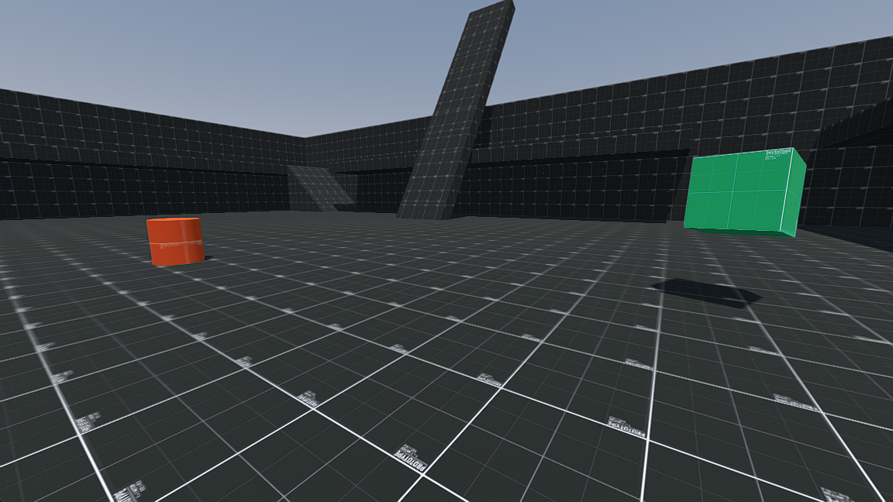

# Godot FPS Template

An FPS controller with rigidbody interaction for Godot 4.0+.

## Prerequisites

Make sure that:

- you are using **Godot 4.0**
- you are using **Godot with .NET 6 build** (Godot Mono version)

## How to

1. Put the `addons\FpsTemplate` under the `addons` folder of your Godot project.
2. Enable the plugin by ticking the checkbox at `Project > ProjectSettings > Plugins > FpsTemplate`.
3. Inside `project.godot` under the root of your Godot project, look for the `[input]` header and add in the following. If there isn't one, simply add an `[input]` header and then paste the following below the header.

```gdscript
LookUp={
"deadzone": 0.5,
"events": [Object(InputEventJoypadMotion,"resource_local_to_scene":false,"resource_name":"","device":-1,"axis":3,"axis_value":-1.0,"script":null)
]
}
LookDown={
"deadzone": 0.5,
"events": [Object(InputEventJoypadMotion,"resource_local_to_scene":false,"resource_name":"","device":-1,"axis":3,"axis_value":1.0,"script":null)
]
}
LookLeft={
"deadzone": 0.5,
"events": [Object(InputEventJoypadMotion,"resource_local_to_scene":false,"resource_name":"","device":-1,"axis":2,"axis_value":-1.0,"script":null)
]
}
LookRight={
"deadzone": 0.5,
"events": [Object(InputEventJoypadMotion,"resource_local_to_scene":false,"resource_name":"","device":-1,"axis":2,"axis_value":1.0,"script":null)
]
}
MoveForward={
"deadzone": 0.5,
"events": [Object(InputEventKey,"resource_local_to_scene":false,"resource_name":"","device":0,"window_id":0,"alt_pressed":false,"shift_pressed":false,"ctrl_pressed":false,"meta_pressed":false,"pressed":false,"keycode":87,"physical_keycode":0,"unicode":0,"echo":false,"script":null)
, Object(InputEventJoypadMotion,"resource_local_to_scene":false,"resource_name":"","device":-1,"axis":1,"axis_value":-1.0,"script":null)
]
}
MoveBack={
"deadzone": 0.5,
"events": [Object(InputEventKey,"resource_local_to_scene":false,"resource_name":"","device":0,"window_id":0,"alt_pressed":false,"shift_pressed":false,"ctrl_pressed":false,"meta_pressed":false,"pressed":false,"keycode":83,"physical_keycode":0,"unicode":0,"echo":false,"script":null)
, Object(InputEventJoypadMotion,"resource_local_to_scene":false,"resource_name":"","device":-1,"axis":1,"axis_value":1.0,"script":null)
]
}
MoveLeft={
"deadzone": 0.5,
"events": [Object(InputEventKey,"resource_local_to_scene":false,"resource_name":"","device":0,"window_id":0,"alt_pressed":false,"shift_pressed":false,"ctrl_pressed":false,"meta_pressed":false,"pressed":false,"keycode":65,"physical_keycode":0,"unicode":0,"echo":false,"script":null)
, Object(InputEventJoypadMotion,"resource_local_to_scene":false,"resource_name":"","device":-1,"axis":0,"axis_value":-1.0,"script":null)
]
}
MoveRight={
"deadzone": 0.5,
"events": [Object(InputEventKey,"resource_local_to_scene":false,"resource_name":"","device":0,"window_id":0,"alt_pressed":false,"shift_pressed":false,"ctrl_pressed":false,"meta_pressed":false,"pressed":false,"keycode":68,"physical_keycode":0,"unicode":0,"echo":false,"script":null)
, Object(InputEventJoypadMotion,"resource_local_to_scene":false,"resource_name":"","device":-1,"axis":0,"axis_value":1.0,"script":null)
]
}
Jump={
"deadzone": 0.5,
"events": [Object(InputEventKey,"resource_local_to_scene":false,"resource_name":"","device":0,"window_id":0,"alt_pressed":false,"shift_pressed":false,"ctrl_pressed":false,"meta_pressed":false,"pressed":false,"keycode":32,"physical_keycode":0,"unicode":0,"echo":false,"script":null)
]
}
Sprint={
"deadzone": 0.5,
"events": [Object(InputEventKey,"resource_local_to_scene":false,"resource_name":"","device":0,"window_id":0,"alt_pressed":false,"shift_pressed":false,"ctrl_pressed":false,"meta_pressed":false,"pressed":false,"keycode":4194325,"physical_keycode":0,"unicode":0,"echo":false,"script":null)
]
}
```

4. Drag the `Player.tscn` scene to your target game scene.
5. In the main script of your game scene, set the input mouse mode to captured in the `_Ready()` override function.

GDScript:

```gdscript
func _ready():
    Input.set_mouse_mode(Input.MOUSE_MODE_CAPTURED)
```

C#:

```csharp
public override void _Ready() {
    Input.MouseMode = Input.MouseModeEnum.Captured;
}
```

6. You should now be able to control the player with the WASD keys.

## Demo scene

1. Import the `project.godot` file of this repository into Godot.
2. Run the `PlayerTest.tscn` scene under `test/Player`.
3. The green cube is a rigidbody which the player can interact with.


